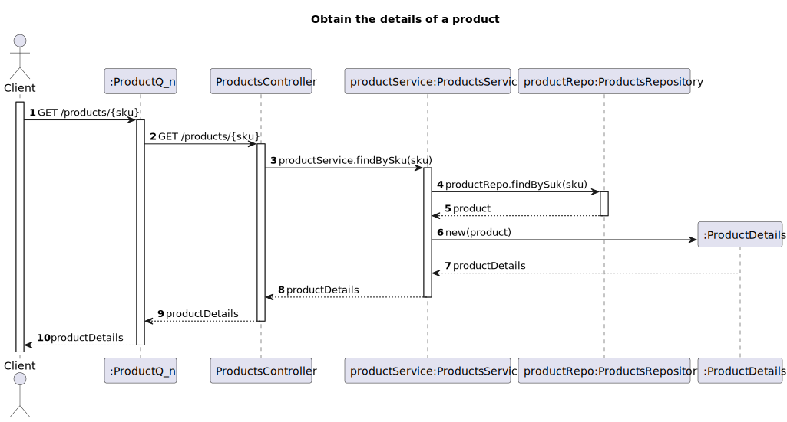
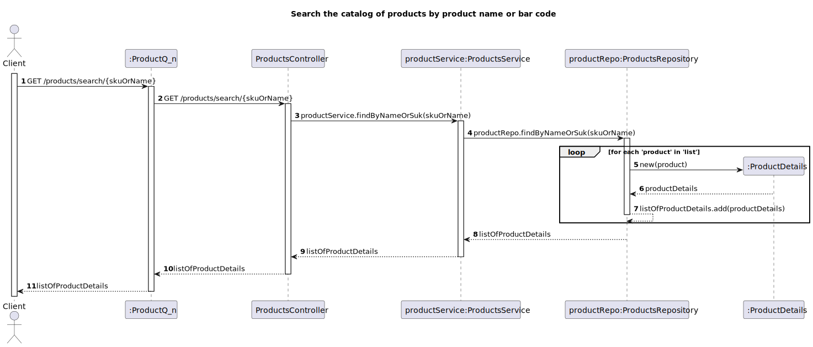
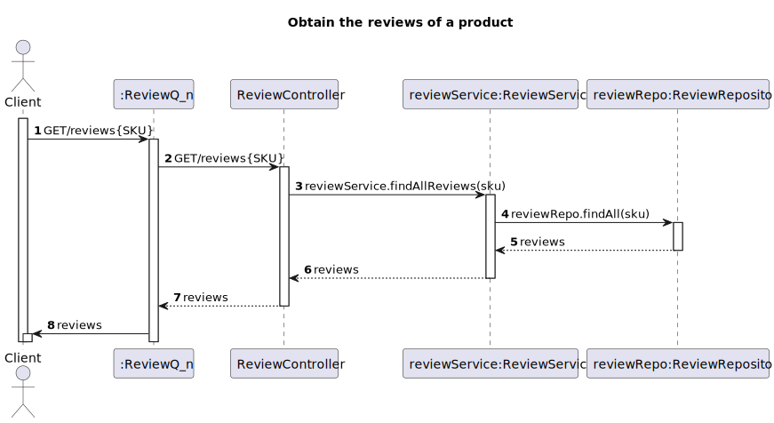
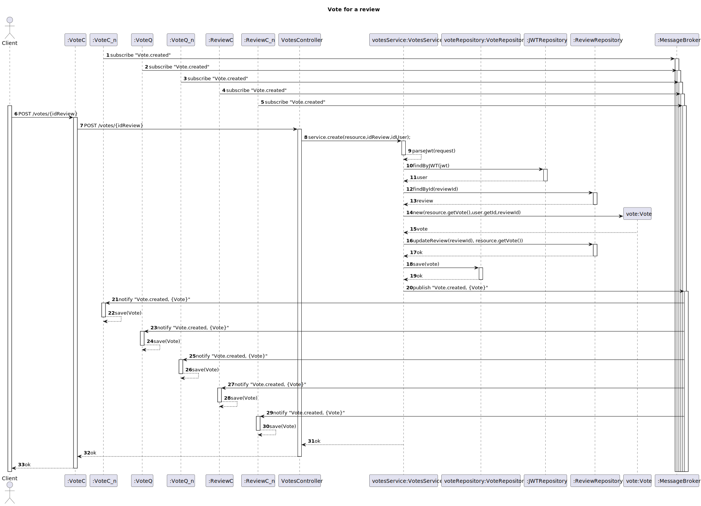
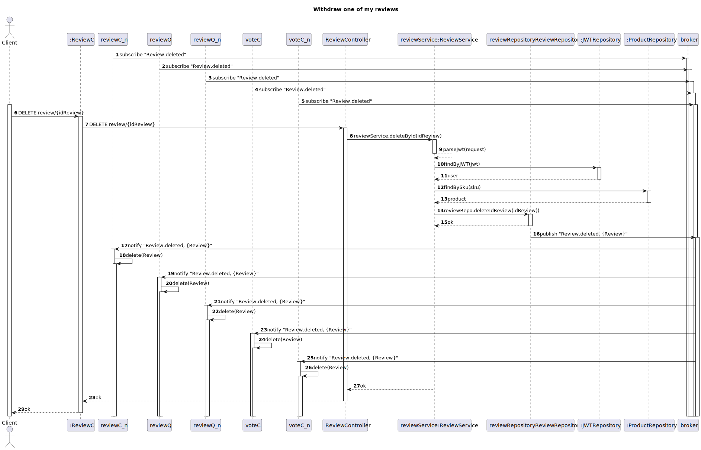
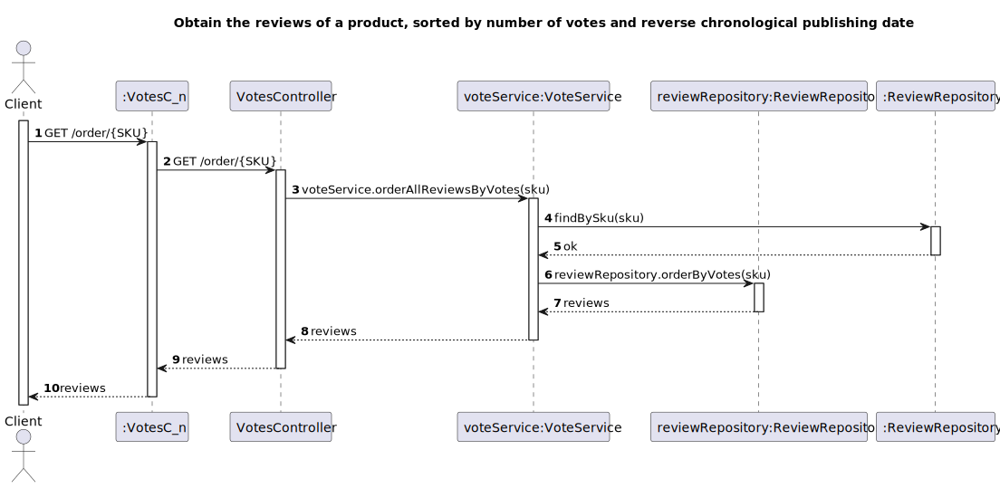
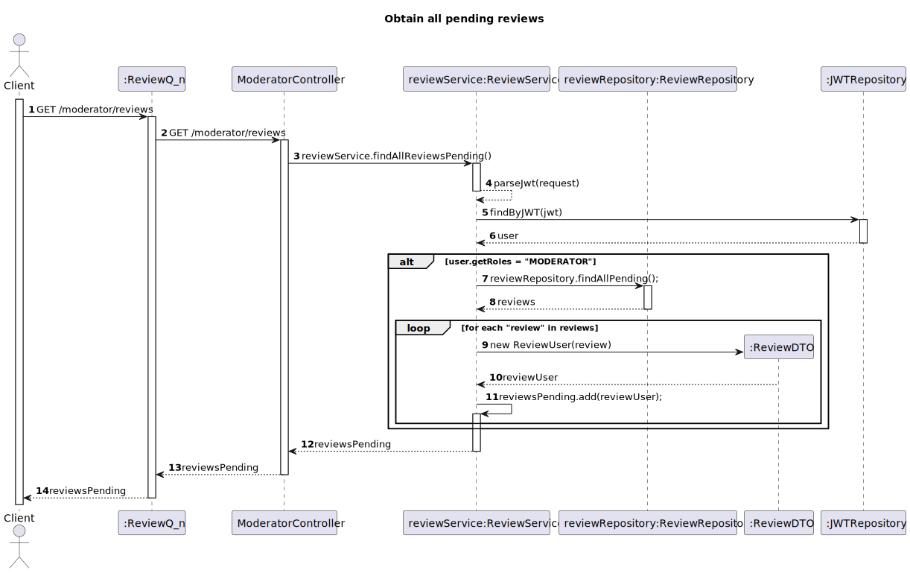
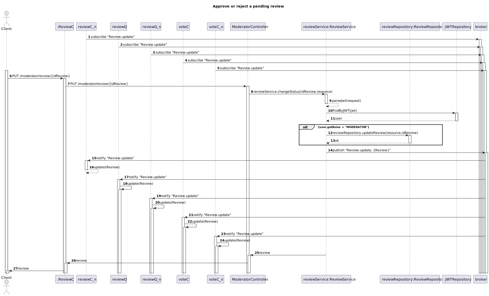
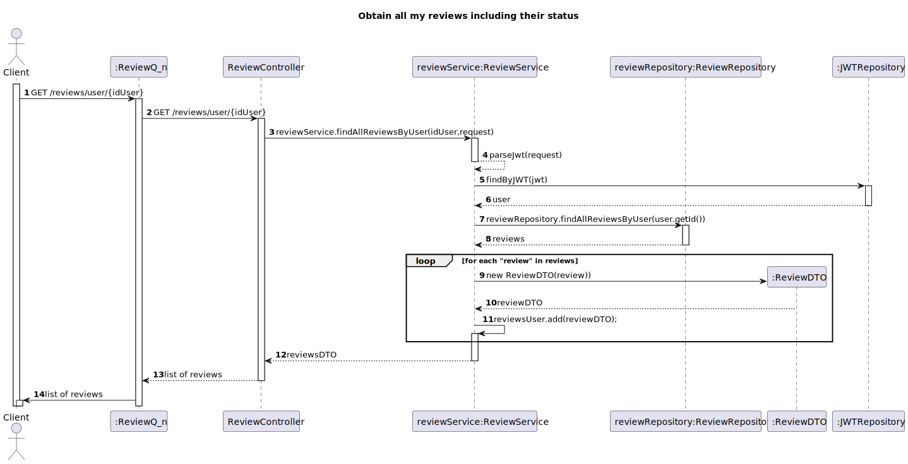
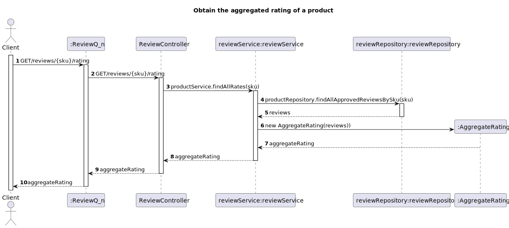

# Docs #

## 1 - UCD (Use Case Diagram)

### 1.1 - US01 (Obtain the catalog of products)

### 1.2 - US02 (Obtain the details of a product)

### 1.3 - US03 (Search the catalog of products by product name or bar code)

### 1.4 - US04 (Review and rate a product)

### 1.5 - US05 (Obtain the reviews of a product)

### 1.6 - US06 (Vote for a review)

### 1.7 - US07 (Withdraw one of my reviews)

### 1.8 - US08 (Obtain the reviews of a product, sorted by number of votes and reverse chronological publishing date)

### 1.9 - US09 (Obtain all pending reviews)

### 1.10 - US10 (Approve or reject a pending review)

### 1.11 - US11 (Obtain all my reviews including their status)

### 1.12 - US12 (Obtain the aggregated rating of a product)

### 1.13 - US13 (To vote in a review that doesn't exist yet)

## 2 - Logic View

## 3 - Observations

The postman collection is available with the name [**SISIDIS.postman_collection.json**](SISIDIS.postman_collection.json)
